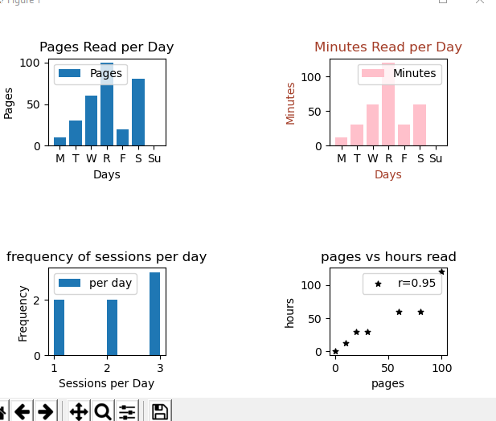

# Pages - a weekly breakdown of your reading habits

# To Run

- Clone the repository

- Start a virtual environment `py -m venv env` and activate `env\scripts\activate`

- Copy the python modules `pip install requirements.txt`

- Run pages.py `pages.py`

# Todo

- [x] Round correlation coefficient to 2 decimal places

- [ ] Modify program to allow for a more intuitive data.txt file
